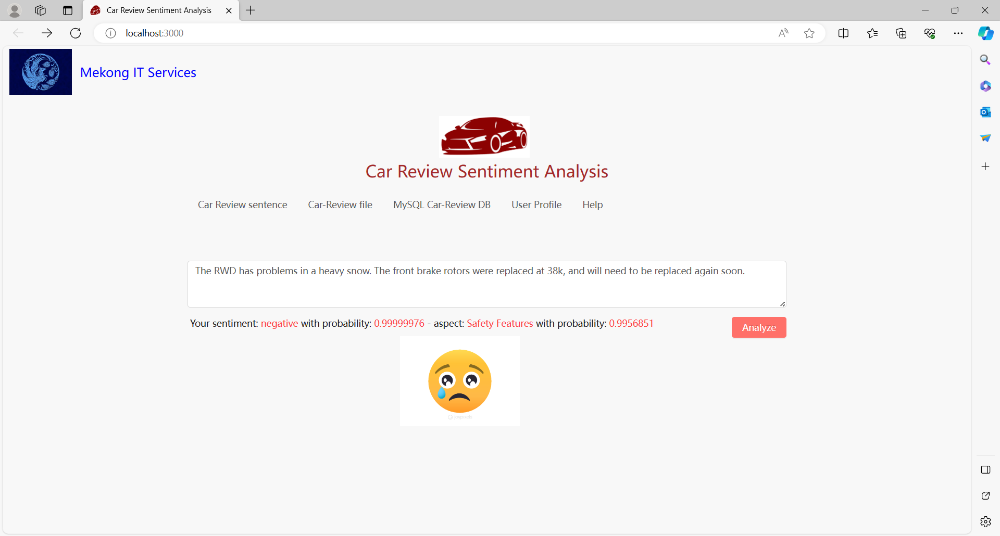

<h1>Sentiment Analysis on Car Reviews</h1>

We are Mekong IT Services, an IT organization (company) established in Calgary, Alberta, Canada.
 
We have new research on Machine Learning for Sentiment Analysis on Car Reviews for Vehicle Dealers, called the "Mekong Carsen" software.
 
<h2>These are our software demonstration</h2>
 
I) Negative Sentiment Detection
 

 
II) Positive Sentiment Detection

 
This software is very useful for Car Dealers who like to have a Python Flask Backend and a React Frontend demonstration.

COPYRIGHT@2023 OF MEKONG IT SERVICES, CALGARY, ALBERTA, CANADA.
